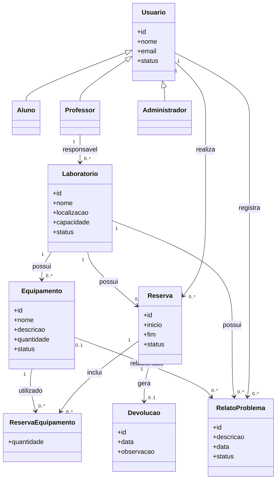

## Diagrama de Classes

```mermaid
classDiagram

class Usuario {
    +id
    +nome
    +email
    +status
}

class Aluno
class Professor
class Administrador

Usuario <|-- Aluno
Usuario <|-- Professor
Usuario <|-- Administrador

class Laboratorio {
    +id
    +nome
    +localizacao
    +capacidade
    +status
}

class Reserva {
    +id
    +inicio
    +fim
    +status
}

class Equipamento {
    +id
    +nome
    +descricao
    +quantidade
    +status
}

class ReservaEquipamento {
    +quantidade
}

class Devolucao {
    +id
    +data
    +observacao
}

class RelatoProblema {
    +id
    +descricao
    +data
    +status
}

Usuario "1" --> "0..*" Reserva : realiza
Laboratorio "1" --> "0..*" Reserva : possui
Professor "1" --> "0..*" Laboratorio : responsavel
Laboratorio "1" --> "0..*" Equipamento : possui
Reserva "1" --> "0..*" ReservaEquipamento : inclui
Equipamento "1" --> "0..*" ReservaEquipamento : utilizado
Reserva "1" --> "0..1" Devolucao : gera
Usuario "1" --> "0..*" RelatoProblema : registra
Laboratorio "1" --> "0..*" RelatoProblema : possui
Equipamento "0..1" --> "0..*" RelatoProblema : relacionado
```