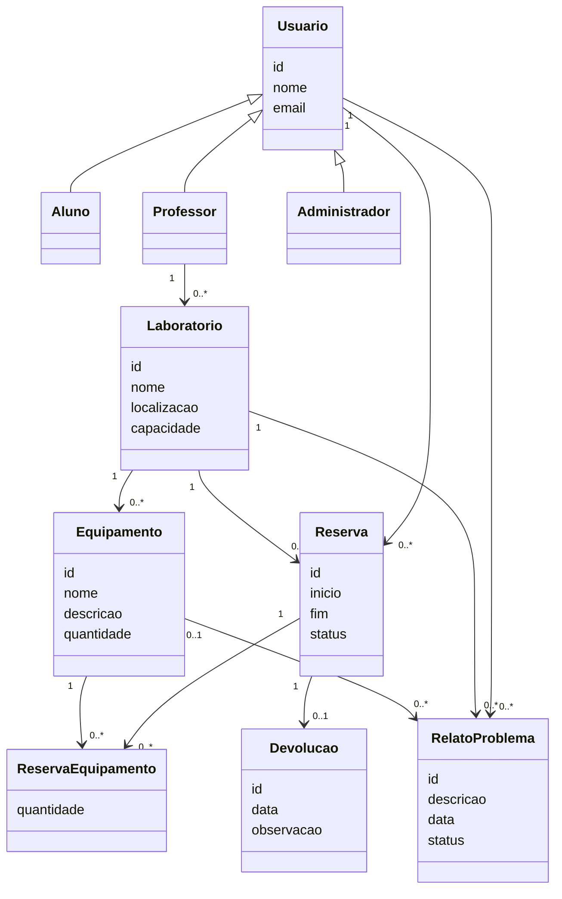

```mermaid
classDiagram

    Usuario <|-- Aluno
    Usuario <|-- Professor
    Usuario <|-- Administrador

    Usuario "1" --> "0..*" Reserva
    Professor "1" --> "0..*" Laboratorio
    Laboratorio "1" --> "0..*" Reserva
    Laboratorio "1" --> "0..*" Equipamento
    Reserva "1" --> "0..*" ReservaEquipamento
    Equipamento "1" --> "0..*" ReservaEquipamento
    Reserva "1" --> "0..1" Devolucao
    Usuario "1" --> "0..*" RelatoProblema
    Laboratorio "1" --> "0..*" RelatoProblema
    Equipamento "0..1" --> "0..*" RelatoProblema

    class Usuario {
        id
        nome
        email
    }

    class Aluno
    class Professor
    class Administrador

    class Laboratorio {
        id
        nome
        localizacao
        capacidade
    }

    class Reserva {
        id
        inicio
        fim
        status
    }

    class Equipamento {
        id
        nome
        descricao
        quantidade
    }

    class ReservaEquipamento {
        quantidade
    }

    class Devolucao {
        id
        data
        observacao
    }

    class RelatoProblema {
        id
        descricao
        data
        status
    }
```