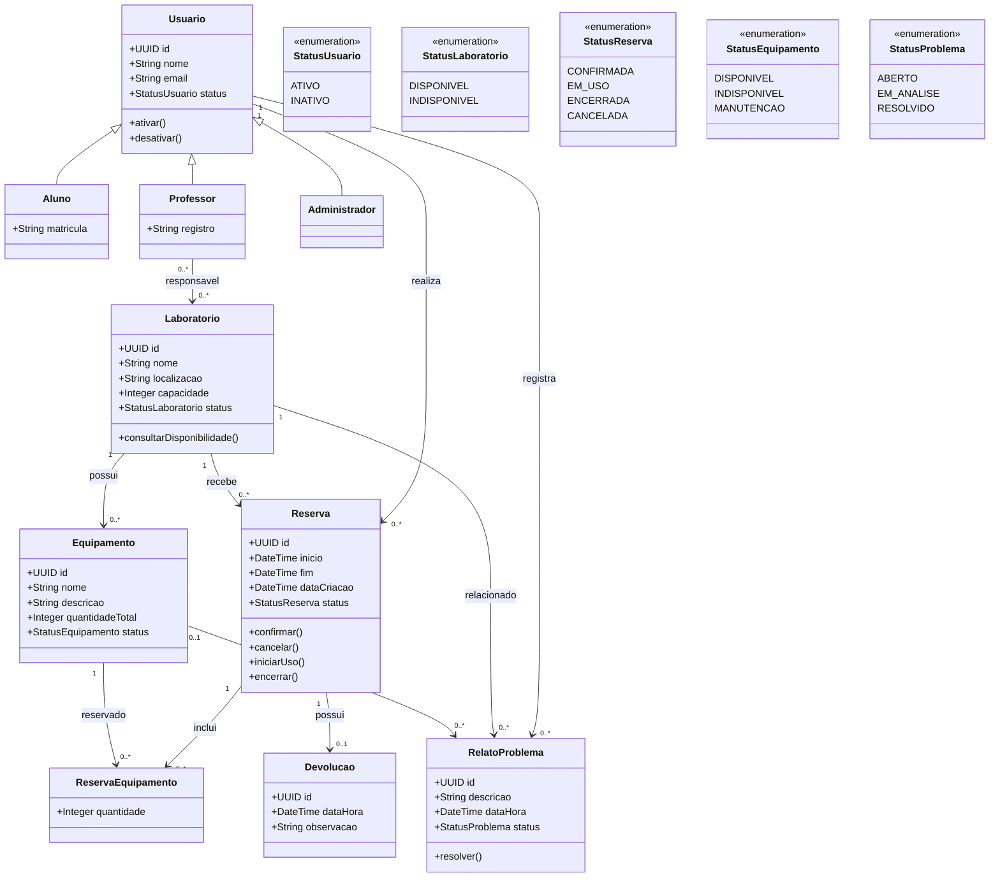

```mermaid
classDiagram

    %% =========================
    %% USUARIOS
    %% =========================

    class Usuario {
        +UUID id
        +String nome
        +String email
        +StatusUsuario status
        +ativar()
        +desativar()
    }

    class Aluno {
        +String matricula
    }

    class Professor {
        +String registro
    }

    class Administrador {
    }

    Usuario <|-- Aluno
    Usuario <|-- Professor
    Usuario <|-- Administrador


    %% =========================
    %% LABORATORIO
    %% =========================

    class Laboratorio {
        +UUID id
        +String nome
        +String localizacao
        +Integer capacidade
        +StatusLaboratorio status
        +consultarDisponibilidade()
    }

    Professor "0..*" --> "0..*" Laboratorio : responsavel


    %% =========================
    %% RESERVAS
    %% =========================

    class Reserva {
        +UUID id
        +DateTime inicio
        +DateTime fim
        +DateTime dataCriacao
        +StatusReserva status
        +confirmar()
        +cancelar()
        +iniciarUso()
        +encerrar()
    }

    Usuario "1" --> "0..*" Reserva : realiza
    Laboratorio "1" --> "0..*" Reserva : recebe


    %% =========================
    %% EQUIPAMENTOS
    %% =========================

    class Equipamento {
        +UUID id
        +String nome
        +String descricao
        +Integer quantidadeTotal
        +StatusEquipamento status
    }

    Laboratorio "1" --> "0..*" Equipamento : possui


    %% =========================
    %% RESERVA DE EQUIPAMENTO
    %% =========================

    class ReservaEquipamento {
        +Integer quantidade
    }

    Reserva "1" --> "0..*" ReservaEquipamento : inclui
    Equipamento "1" --> "0..*" ReservaEquipamento : reservado


    %% =========================
    %% DEVOLUCAO
    %% =========================

    class Devolucao {
        +UUID id
        +DateTime dataHora
        +String observacao
    }

    Reserva "1" --> "0..1" Devolucao : possui


    %% =========================
    %% RELATO DE PROBLEMA
    %% =========================

    class RelatoProblema {
        +UUID id
        +String descricao
        +DateTime dataHora
        +StatusProblema status
        +resolver()
    }

    Usuario "1" --> "0..*" RelatoProblema : registra
    Laboratorio "1" --> "0..*" RelatoProblema : relacionado
    Equipamento "0..1" --> "0..*" RelatoProblema : afetado


    %% =========================
    %% ENUMERACOES
    %% =========================

    class StatusUsuario {
        <<enumeration>>
        ATIVO
        INATIVO
    }

    class StatusLaboratorio {
        <<enumeration>>
        DISPONIVEL
        INDISPONIVEL
    }

    class StatusReserva {
        <<enumeration>>
        CONFIRMADA
        EM_USO
        ENCERRADA
        CANCELADA
    }

    class StatusEquipamento {
        <<enumeration>>
        DISPONIVEL
        INDISPONIVEL
        MANUTENCAO
    }

    class StatusProblema {
        <<enumeration>>
        ABERTO
        EM_ANALISE
        RESOLVIDO
    }
```